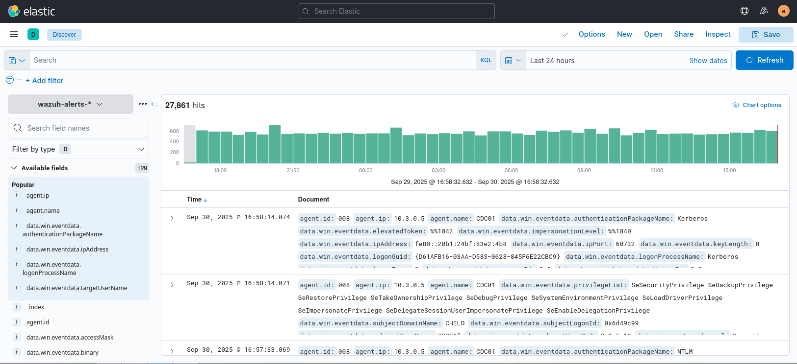
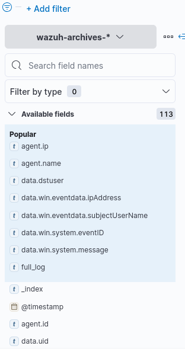
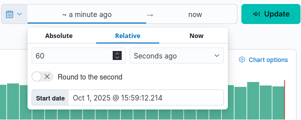

Analytics → Discover this section is your bestie. 

# Filtering (KQL)

Some goofy ahh tutorial how to use ELK Stack properly. So when we login into wazuh integrated with ELK Stack we usually go in to Analytics → Discover as mentioned before. There are all logs stored and even the timeline is given. 



From all indexes the most interesting usually are wazuh-archives* . So the most important here is KQL queries that help you a lot. Let's give there list of most important parameters and operators to use: 



Do **not make it complicated**. It is easy to use KQL, example *data.win.system.eventID : 7036 and "Remote Registry"* says: "hey find me windows event ID number 7036 words related are *Remote Registry*". In case of evenIDs rely on <a href='WindowsEventID - CPTAv2.md'>Windows Event ID Cheatsheet</a>. Additionally go under [this link](https://learn.microsoft.com/en-us/windows-server/identity/ad-ds/plan/appendix-l--events-to-monitor) and check for additional eventIDs. Such filtering methods are enough for CPTAv2 labs. 

So example rule is looking like this: 
```
<rule id="33119" level="6">  
<if_sid>60000</if_sid>  
<field name="win.system.eventID">1015</field>  
<description>Antimalware platform detected suspicious behavior</description>  
</rule>
```

another example for special privileges:
```
<rule id="33120" level="3">  
<if_sid>60103</if_sid>  
<field name="win.system.eventID">^4672$</field>  
<options>no_full_log</options>  
<description>Special privileges were assigned to a new logon</description>  
</rule>
```

Please go trough ELK rule creation document for further analysis of this process.
The next thing to remember in ELK Stack is to take notes. Don't forget about setting the timeline to don't waste system resources to check the traffic. 
